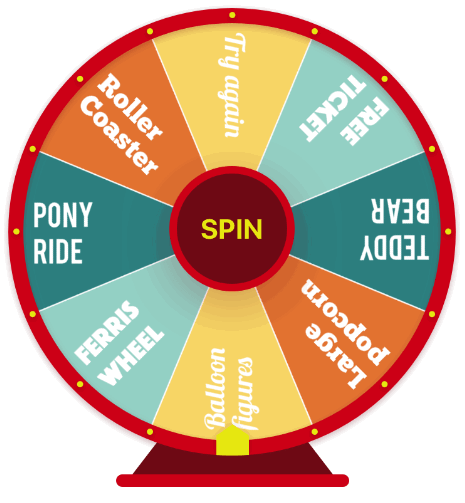

# TTFortuneWheel-iOS


[](https://cocoapods.org/pods/TTFortuneWheel)
[](https://cocoapods.org/pods/TTFortuneWheel)
[](http://cocoapods.org/pods/TTFortuneWheel)
[](http://twitter.com/Tapptitude)

## About
Fortune spinning wheel that supports custom drawing. 

This project is maintained by Tapptitude, a Product-Focused Mobile Development Agency based in Cluj-Napoca, Romania, and London, the UK, specialised in building high-quality Native Mobile Apps on iOS & Android. 



## Features:
- Dynamic content 
- Each slice can have it's own style and angle 
- Drawn and animated using CoreGraphics
- Customize(Font, Slice Color, Stroke, Frame color, width and shadow) 
- Predictible rotation to any slice 
- Exposes methods for custom Core Grapgics drawings for each slice 
- Dynamic size

## Requirements

- iOS 9.0+
- Xcode 8.2+

## Installation

_CocoaPods_

_Swift 4.0_

```ruby
pod 'TTFortuneWheel'
```

_Carthage_

```
github "tapptitude/TTFortuneWheel-iOS"
```

_Manually_

Add contents of TTFortuneWheel folder to your project. 

## Usage

You can place the FortuneWheel in your storyboard or add it as sa subview programatically. 

```swift

override func viewDidLoad() {
        super.viewDidLoad()
        
        let slices = [ FortuneWheelSlice(title: "Slice 1"),
                       FortuneWheelSlice(title: "Slice 2"),
                       FortuneWheelSlice(title: "Slice 3")]
        
        let fortuneWheel = TTFortuneWheel(frame: frame, slices:slices)
        spinningWheel.equalSlices = true
        self.view.addSubview(fortuneWheel)        
}
```
## How to customize?

In order to provide custom drawing for slices you have to implement `FortuneWheelSliceProtocol`. 
or can use the preconfiugred `FortuneWheelSliceImpl` class.

## Contribution

Feel free to Fork, submit Pull Requests or send us your feedback and suggestions!


## License

TTSegmentedControl is available under the MIT license. See the LICENSE file for more info.
